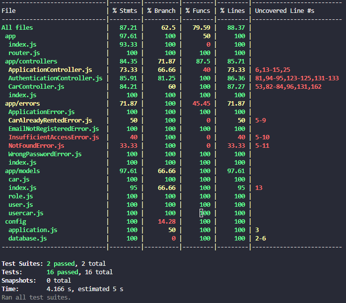

# BCR API

Sebuah repositori challenge 7 Binar Academy (Unit Tesing)

Di dalam repository ini terdapat implementasi API dari Binar Car Rental.
Tugas kalian disini adalah:

1. Fork repository
2. Tulis unit test di dalam repository ini menggunakan `jest`.
3. Coverage minimal 70%

Good luck!

### Hasil Testing

### API URL

[unit-testing-binar-car-rental-production.up.railway.app](unit-testing-binar-car-rental-production.up.railway.app)
